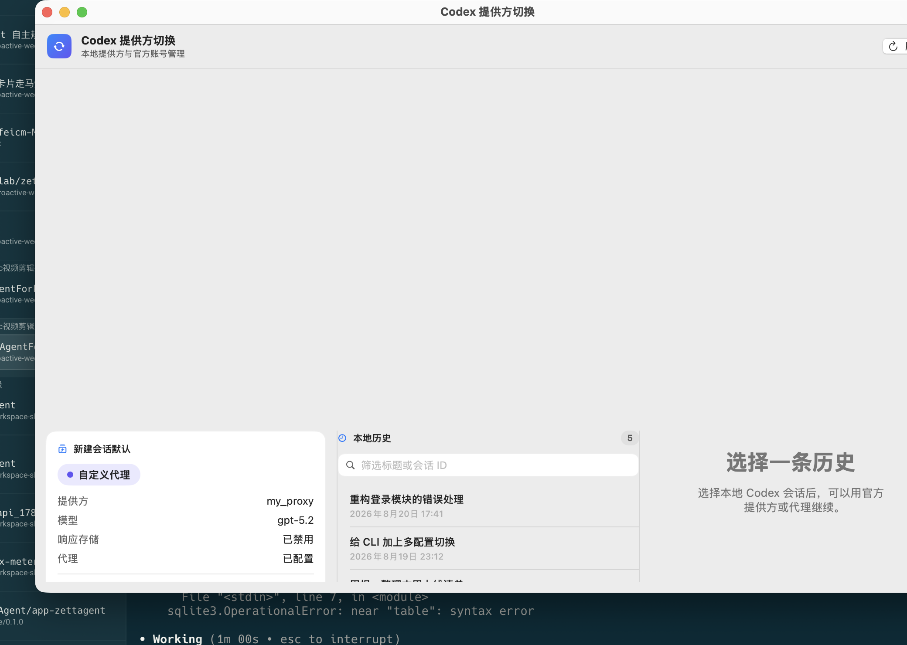

# Codex Provider Switcher for macOS

A small native SwiftUI app for choosing local Codex history and controlling the default provider without a ChatGPT Agent plugin.

## What it does

- reads `~/.codex/config.toml` and the lightweight `session_index.jsonl` only while the app is open;
- opens the official history picker with `codex --dangerously-bypass-approvals-and-sandbox -c 'model_provider="openai"' resume --all`;
- resumes the selected local history through either `openai` or your custom proxy provider with an explicit provider override — any non-`openai` `[model_providers.*]` table in `config.toml` is picked up automatically, whatever it is named;
- switches the default provider for future Codex processes, creating an atomic `config.toml` backup first;
- manages multiple official ChatGPT accounts: saves `auth.json` snapshots into `~/.codex/auth-store/<account>/`, switches the active login by swapping `auth.json`, and syncs refreshed tokens back into the store before every switch. Only the `id_token` email claim is ever displayed — token contents never reach the UI;
- never reads credential files (API keys, provider tokens) beyond the account-store behavior above;
- honors `CODEX_HOME` to point at an isolated directory, same convention as the codex CLI;
- has no HTTP server, browser process, watcher, timer, or third-party dependency.

The key distinction is deliberate: opening the official picker always uses OpenAI, but a selected session can be launched through your proxy without changing the global default provider.

## Interface



The screenshot was captured against a demo `CODEX_HOME` filled with sample accounts and sessions — nothing on it is real data.

### Adding another official account

OpenAI has no native multi-account switching, so this app uses the snapshot-swap approach:

1. In a terminal run `codex login`, and sign in with the other account in the browser. **Never run `codex logout` to change accounts** — logout revokes the current account's refresh token server-side, which invalidates the snapshot stored for the account you are leaving. Plain `codex login` overwrites the active login without revoking anything.
2. Back in the app, click 保存当前登录到账号库.
3. Repeat for each account. Switch with the 切换 button; only Codex processes started after the switch use the new login. Snapshot switching never revokes tokens.

Close running Codex sessions before switching: a live session can refresh its tokens and overwrite `auth.json` after the swap.

## Build and install

```bash
./scripts/build-app.sh
open "$HOME/Applications/Codex Provider Switcher.app"
```

## Development checks

```bash
swift test
swift build -c release
```
